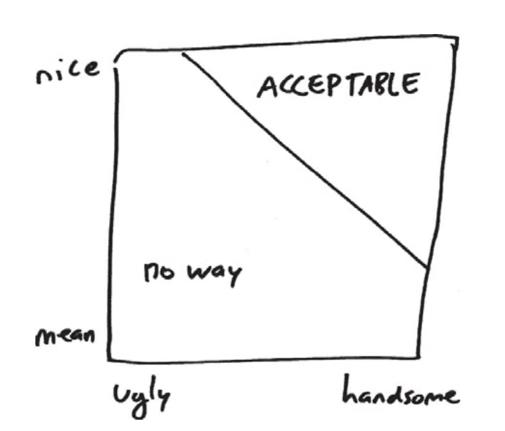

This image explains self selecting bias well. Let's say I am looking to find a partner, and I am only willing to date someone who is either nice and/or attractive. The below plot shows a line thresholding who I'm willing to date. Even though the population of people is uniformly distributed across niceness and attractiveness, I may start to think that hot people are usually mean, just because I'm more willing to date someone mean as long as they are hot.
