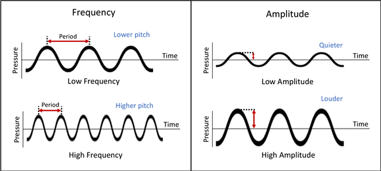

A Fourier transform is essentially a coordinate shift from the time domain to the frequency domain. In the Fourier domain, **frequency** is on the x-axis and **amplitude** is on the y-axis.

> The Fourier Transform shows that any waveform can be re-written as the sum of sinusoidal functions.

More detail is [here](http://www.thefouriertransform.com)